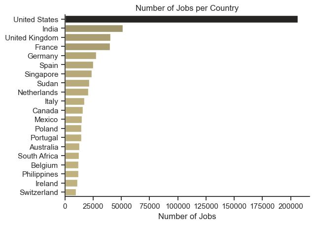
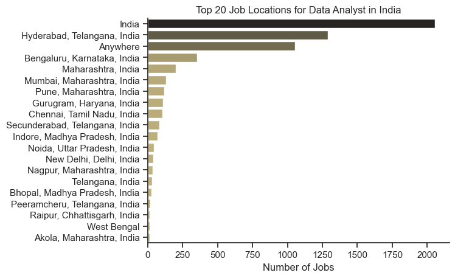
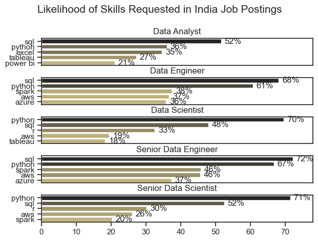
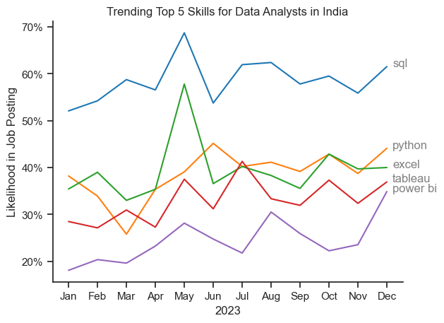
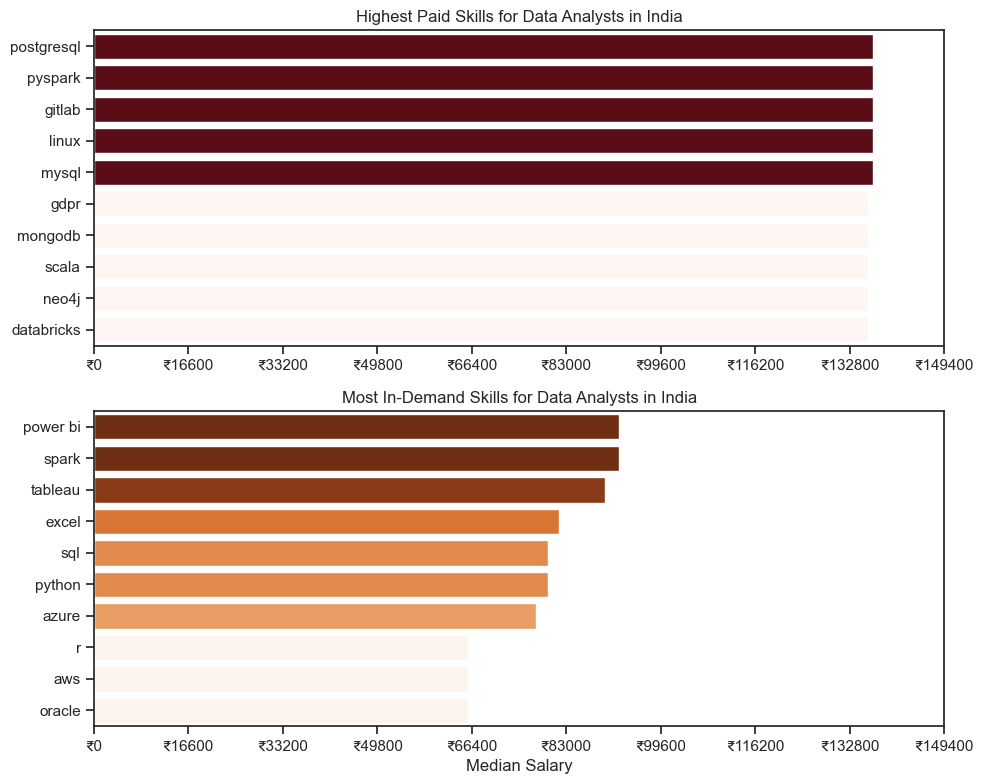
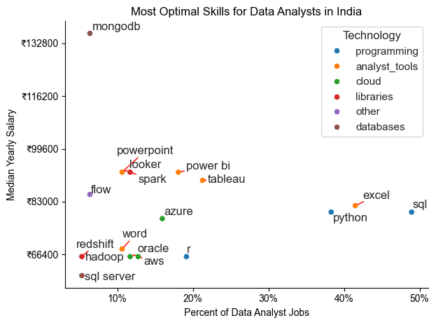

# Exploratory Data Analysis (EDA) for Data Analyst Skills and Salaries

## Overview

This Jupyter Notebook provides an exploratory data analysis (EDA) of Data Analyst skills and salaries in India. The analysis includes visualizations for salary distributions, in-demand skills, and highest paid skills.

## Research Questions

This project aims to answer the following questions:

1. Which skills are most in demand for the top 3 most popular data roles?
2. What are the trends in demand for Data Analyst skills?
3. What are the salary trends for Data Analysts based on different jobs and skills?
4. What are the optimal skills for Data Analysts to learn that are both in high demand and high paying?

# Tools I Used

For my deep dive into the data analyst job market, I harnessed the power of several key tools:

- **Python:** The backbone of my analysis, allowing me to analyze the data and find critical insights.I also used the following Python libraries:
    - **Pandas Library:** This was used to analyze the data. 
    - **Matplotlib Library:** I visualized the data.
    - **Seaborn Library:** Helped me create more advanced visuals. 
- **Jupyter Notebooks:** The tool I used to run my Python scripts which let me easily include my notes and analysis.
- **Visual Studio Code:** My go-to for executing my Python scripts.
- **Git & GitHub:** Essential for version control and sharing my Python code and analysis, ensuring collaboration and project tracking.

## Structure

1. **Data Loading and Preparation**
   - Import libraries
   - Load and clean data

2. **Descriptive Statistics**
   - Summary statistics and basic insights

3. **Visualizations**
- **Number of Jobs per Country**:

        The chart highlights the global demand for data analysts, with notable opportunities in European and Asian countries as well.

- **Top 20 Job Locations for Data Analysts in India**:

        This bar chart highlights the top 20 locations in India for data analyst jobs, with Hyderabad and Bengaluru being the leading cities.

- **Likelihood of Skills Requested in India Job Postings**: 

        This bar chart compares the likelihood of various skills being requested for different data analyst roles in India, highlighting SQL, Python, and Excel as the most frequently sought-after skills.

- **Trending Top 5 Skills for Data Analysts in India**: 

        This line chart shows the monthly trends of the top 5 skills requested for Data Analyst positions in India throughout 2023, with SQL consistently being the most in-demand skill.

- **Highest Paid and Most In-Demand Skills for Data Analysts in India**: 

        This dual bar chart highlights the highest paid skills and the most in-demand skills for Data Analysts in India, with PostgreSQL and Power BI leading in each category respectively.

- **Most Optimal Skills for Data Analysts in India**:

        This scatter plot identifies the most optimal skills for Data Analysts in India, showcasing skills that are both in high demand and offer high median yearly salaries, with SQL and Python being prominent.

# Conclusion

This exploration of the data analyst job market has been highly informative, shedding light on the critical skills and trends that define this evolving field. The insights gained enhance understanding and offer actionable guidance for those looking to advance their careers in data analytics. As the market continues to evolve, ongoing analysis will be crucial to staying ahead in the field. This project serves as a strong foundation for future explorations and underscores the importance of continuous learning and adaptation in data analytics.
